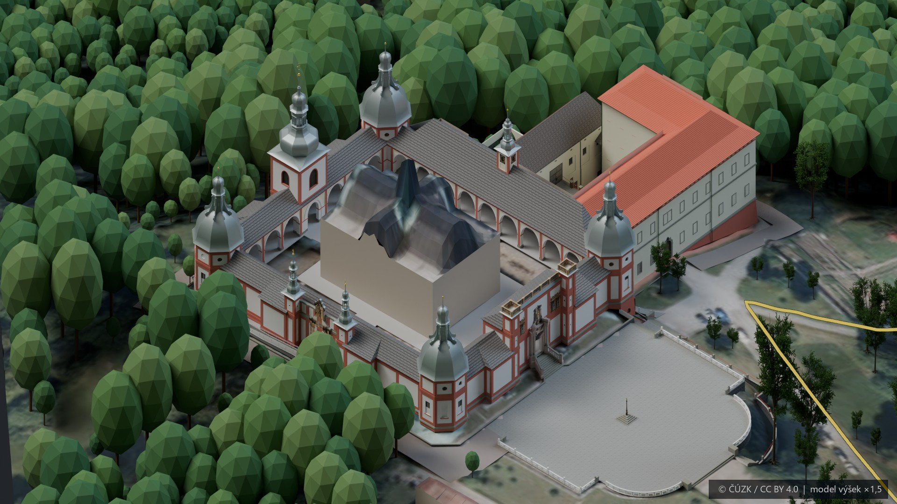
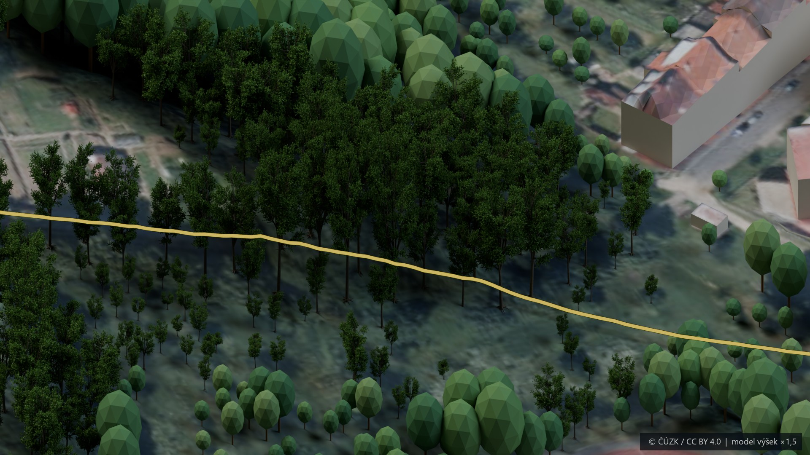
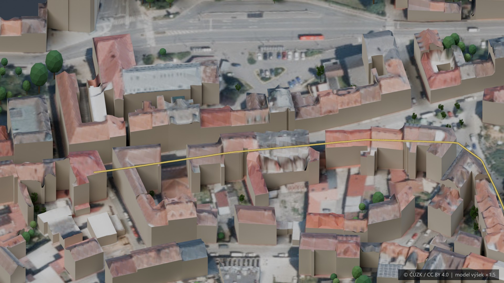

# 3D model trati – tři náhledy na mobil

Výběr snímků verze 07. JPG v rozlišení 1920 × 1080 pro snadné otevření na telefonu.

## 1. Svatá Hora a start

[Otevřít snímek samostatně](01-svata-hora.jpg)

## 2. Lesní úsek – detail stromů

Zóna S02, úsek 200–300 m.

[Otevřít snímek samostatně](02-lesni-usek.jpg)

## 3. Dojezd do cíle

Zóna S05, úsek od 800 m po cíl.

[Otevřít snímek samostatně](03-cil.jpg)

Snímky pocházejí z průběžných uložených kontrol jednotlivých úseků verze 07. Středová bazilika je zatím zjednodušená; kompletní model bude doplněn po dodání podkladů.

Tuto složku lze po prohlédnutí celou smazat. Pracovní model a původní rendery jsou uložené samostatně na počítači.

