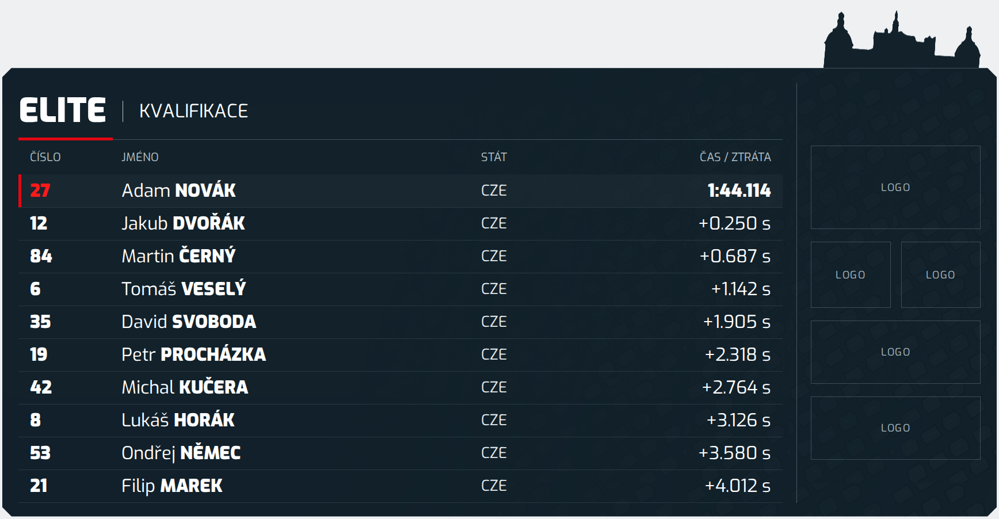

# Karta výsledků — verze 01

> Aktualizace 9. 9. 2026: platí společný styl s menším bílým nápisem SVATOHORSKÝ / DOWN / TOWN vycentrovaným pod celým reliéfem. Pouze písmo z původního loga, bez kruhu, přidané linky a roku. Tato aktualizace nahrazuje předchozí zákaz samostatného nápisu. Animace budou upřesněny zadavatelem později; tato změna žádné nové animace nezavádí.

Funkční HTML/CSS grafika podle studie 04. Deset výsledků vlevo a menší prostor pro loga vpravo jsou součástí stejného panelu. Celý reliéf je na pravém horním kraji, bez nadpisu Partneři.

[Zadání a plán dalšího fungování](ZADANI_KARTA_VYSLEDKU.md) · [Poslední schválená studie](nahledy/studie-04.jpg) · [Průhledný výstup](nahledy/vysledky-overlay.png)

## Použití

Otevřete index.html po stažení repozitáře nebo přejděte ze společného rozcestníku. Měňte kategorii a typ jízdy; výsledky načtěte přes Načíst JSON. Tlačítko Uložit JSON stáhne aktuální datovou sadu. Úpravy v prohlížeči se samy nezapisují do GitHubu ani do Actions.

Výchozí data jsou v data.js a jsou **fiktivní**. Strukturu JSON získáte tlačítkem Uložit JSON. Časy zadávejte jako celé milisekundy; první čas se zobrazí absolutně, ostatní jako ztráta proti prvnímu řádku. Připravený vstup pro budoucí adaptér je window.SVDTResults.setData(data).

## Generování PNG, včetně iPadu

V GitHubu otevřete **Actions → SVDT — generování náhledů → Run workflow**. Volitelně vyplňte results_category, results_run_type a results_json (celý datový objekt). Po dokončení stáhněte artefakt **svdt-grafika-nahledy**, složku karta-vysledky. Při vlastních vstupech obsahuje také vysledky-vlastni.png. Bez vlastních vstupů používá data.js.

Lokálně: npm install, npx playwright install chromium, poté npm run render:vysledky. npm run render vytváří všechny tři karty.

- vysledky-overlay.png: 1920 × 1080, průhledné okolí, bez pomocných rezerv log.
- vysledky-detail.png: kontrolní výřez z kódu s rezervami pro loga.
- Světlý/tmavý náhled a dlouhé jméno: další kontrolní exporty v artefaktu.
- kontrola.json: výsledky automatických kontrol v artefaktu.

Pro samotnou HTML vrstvu použijte index.html?capture=1. Parametry category a runType mění hlavičku. Pomocné rezervy log vyžadují výslovně placeholders=1; nejsou výchozím vysílaným obsahem.

## Podklady a další etapa

Font Exo, maska reliéfu a MTB stopa se sdílejí z karta-jezdce/, nejsou duplikované. Skutečná loga vložte do assets/ této složky a vyplňte logos: [{src: "assets/partner.png", alt: "Název partnera"}]. PNG/JPEG/WebP/SVG se vloží bez deformace. Výchozí rozložení podporuje pět míst; pořadí je první široké, dvě menší, dvě široká.

**Živý server, volné rozmísťování log v budoucím HTML editoru a animace se budou řešit později.** Podrobnosti i potvrzená rozhodnutí jsou v zadání. Studie je vizuální reference; generované PNG vznikají z editovatelných zdrojů.

Sdílený zdroj písma loga: `../design-system/brand/event-wordmark.svg`; pozice a velikosti: `../design-system/brand/event-wordmark.css`. Jde o výřez původního loga se zachovanými tvary písmen a texturou, nikoli náhradní font. Osa nápisu je shodná s osou celého reliéfu. Automatické kontroly ověřují načtení, vystředění, umístění uvnitř karty a nepřekrývání údajů ani partnerů. Aktuální náhledy vznikají z kódu; starší studie jsou pouze historické reference.
