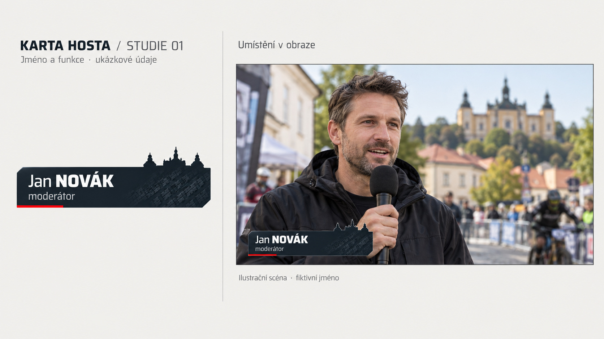

# Karta hosta

**Schválený vizuální návrh: studie 01 (9. 9. 2026).**

Decentní jmenovka pro rozhovorové vstupy mezi jízdami: pouze jméno a funkce. Vychází z identity karty jezdce 06.4, včetně celého reliéfu Svaté Hory a jemné stopy pneumatiky.

- [Zadání pro implementaci](ZADANI_KARTA_HOSTA.md)
- [Schválený náhled](nahledy/karta-hosta-studie-01.jpg)

V této složce je zatím schválený náhled a zadání, nikoliv funkční karta nebo hotová animace. Animaci doplní zadavatel později. Jméno a scéna jsou ilustrační.
