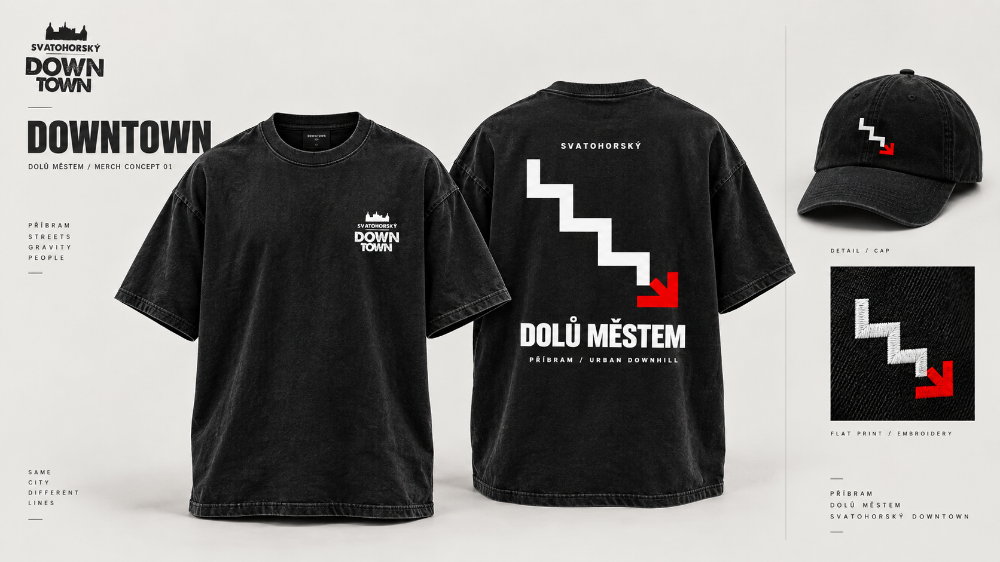

# DOLŮ MĚSTEM — koncept 01

Jednoduchý streetwear pro Svatohorský Downtown. Schodová linka končící červenou šipkou převádí městský sjezd do jediného výrazného symbolu. Bez data, aby se merch dal nosit i mezi ročníky.

## Tričko

- Černý washed / charcoal podklad, oversized střih, doporučená gramáž 220–260 g/m².
- Přední strana: malé bílé logo Svatohorský Downtown na levé hrudi, orientační šířka 7–8 cm.
- Záda: bílá schodová linka s červenou šipkou; texty „SVATOHORSKÝ“, „DOLŮ MĚSTEM“ a „PŘÍBRAM / URBAN DOWNHILL“. Orientační šířka motivu 27–30 cm, přizpůsobit velikosti oděvu.
- Dvě barvy potisku: bílá a sytá červená. Výchozí digitální červená #E30613; finální odstín určit podle fyzického vzorku barvy na textilu.

## Kšiltovka

Černá bavlněná kšiltovka, vpředu pouze schodová šipka v bílé a červené výšivce. Doporučená šířka přibližně 4–5 cm. Jednoduchý symbol funguje i jako samostatná nášivka.

## Stav návrhu

PNG je vizuální koncept vytvořený pomocí ImageGen, nikoli tiskový master. Referencí loga byla dodaná pozvánka „RIDERS INVITATION SVDT 2026_email.pdf“. Před výrobou vložit původní oficiální logo bez generativních odchylek, převést finální grafiku do vektorů, připravit separace barev a ověřit minimální tloušťky pro zvolený tisk / výšivku. Rozměry výše jsou návrhové, nikoli naměřené z mockupu.
